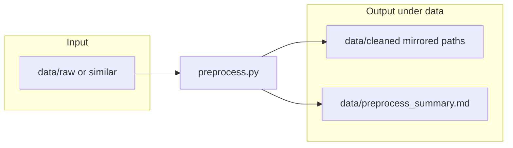

# JSONL date normalization under `data/`

## Current state

[data_creation/preprocess.py](data_creation/preprocess.py) already provides:

- **JSONL scan**: `discover_jsonl_files` via `Path.rglob("*.jsonl")`.
- **Recursive normalization**: `normalize_dict` → `normalize_value` (dict/list/scalars); time-object branch calls `timestamp_from_time_object` with sibling `*Date` / `*DateTime` heuristics (see `timestamp_from_time_object`).
- **String timestamps**: `parse_to_utc` + `format_utc` (UTC, `Z` suffix).
- **Stats**: `TableStats` with `record_count`, `malformed_lines`, `column_types` (top-level keys only), `non_timestamp_nested_paths` (nested dict/list visit counts), plus counters for normalized strings and flattened time objects.
- **Outputs today**: cleaned lines go to `data_exploration_results/normalized_data/`; report to `data_exploration_results/normalizedates_report.md`.

Your requirement is to **put outputs only under `data/`**, in one file, with recursion for nesting—the logic is largely there; the work is **path/layout policy**, **rglob safety**, and **optional stat/report tightening**.

## Recommended layout (avoids reading cleaned files)

- **Constants** at top of `preprocess.py` (single source of truth):
  - `INPUT_ROOT = Path("data/raw")` (or `data/in`) — default place to drop source `.jsonl`.
  - `OUTPUT_ROOT = Path("data/cleaned")` — mirror relative paths from `INPUT_ROOT`.
  - `REPORT_PATH = Path("data/preprocess_summary.md")` (or `data/summary.md`).
- **Alternative** if you insist on a single `data/` tree without `raw/`: set `INPUT_ROOT = Path("data")` and **exclude** `OUTPUT_ROOT` (and the report file) from discovery so `rglob("*.jsonl")` never ingests prior runs.

## Implementation changes (all in `preprocess.py`)

1. **Replace** `DATA_ROOT` / `OUTPUT_ROOT` / `REPORT_PATH` with the triple above; update `render_report` strings to show both resolved input and output roots.
2. `**discover_jsonl_files`**: after collecting paths, **filter out any path under `OUTPUT_ROOT` (and optionally ignore `REPORT_PATH.parent` if it could ever hold `.jsonl`).
3. **Table grouping**: keep current behavior (`relative.parts[0]` as table name) but relative to `INPUT_ROOT` so mirrored output stays predictable.
4. **Stats / report** (align with your list):

- **Records** / **malformed**: already counted in `process_file`.
- **Column types**: today only **top-level** keys get `column_types`. To match “nested paths” intent, add a small recursive helper (e.g. `collect_leaf_types(obj, path_prefix, stats)`) that records dot-paths for scalars (and optionally `[]` for list positions or a single `parent[]` aggregate—pick one consistent rule and document it in the report header).
- **Nested paths**: keep `non_timestamp_nested_paths` for dict/list traversal counts; optionally split “visited nested path” vs “leaf type path” in the MD sections for clarity.

1. **Recursion**: keep the existing mutual recursion or refactor to one `normalize_node(value, path, stats, context)` that dispatches on type—behavioral equivalence, cleaner single entry point (optional polish, not required for correctness).
2. `**main()`: `FileNotFoundError` if `INPUT_ROOT` missing; print resolved paths; ensure `OUTPUT_ROOT` / report parent dirs are created (already done for output files).

## Optional extensions (only if you want them in scope)

- **Numeric epochs** (int/float ms/s) as timestamps—requires heuristics (field name patterns or magnitude) to avoid corrupting arbitrary numbers.
- **Sibling merge cleanup**: after combining `{foo}Time` + `{foo}Date`, optionally drop the redundant date field—changes semantics; skip unless explicitly desired.

## Files touched

- **Only** [data_creation/preprocess.py](data_creation/preprocess.py).
- **No** new modules; user creates `data/raw` (or chosen input folder) and runs from repo root: `python data_creation/preprocess.py`.

## Verification

- Run on a small fixture: nested dict, list of objects, ISO strings with/without timezone, `{"hours","minutes","seconds"}` next to a matching `*Date` key, malformed line, non-dict JSON line.
- Confirm output `.jsonl` only under `data/cleaned/...` and report at `data/preprocess_summary.md`; confirm second run does not double-process cleaned files.
