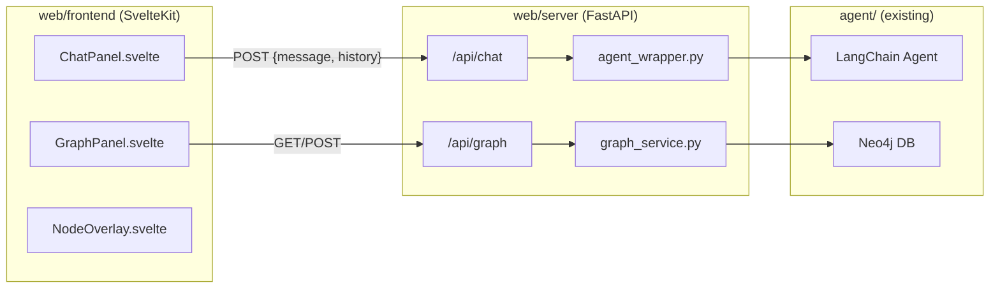

# Web UI for Neo4j Graph Agent

## Architecture



## Folder Structure

```
web/
  server/
    main.py              # FastAPI app with CORS, /api/chat, /api/graph
    agent_wrapper.py     # Wraps existing agent with conversation history
    graph_service.py     # Neo4j direct queries for graph visualization
    .env                 # Copied from agent/.env
    pyproject.toml       # FastAPI + uvicorn + existing agent deps
  frontend/
    src/
      routes/+page.svelte         # Main layout (graph left, chat right)
      lib/
        components/
          ChatPanel.svelte        # Chat UI with messages + input
          GraphPanel.svelte       # vis-network graph visualization
          NodeOverlay.svelte      # Floating node detail card
        stores/chat.ts            # Svelte store for messages + graph state
        types.ts                  # Shared TypeScript types
    .env                          # API base URL
    package.json
    svelte.config.js
    vite.config.ts
```

## Backend (`web/server/`)

### `main.py` - FastAPI Server

- **`POST /api/chat`**: Accepts `{ message: string, history: { role, content }[] }`. Invokes the agent with up to the last 7 conversation exchanges (14 messages). Parses the YAML response from the agent to extract `message`, `cypher_queries`, `todos`, `confidence`. Returns both the parsed response and graph data from re-executing the Cypher queries.
- **`GET /api/graph`**: Returns the initial full graph. Runs:
  ```cypher
  MATCH (n)-[r]->(m) RETURN n, r, m LIMIT 500
  ```
  Serializes Neo4j Node/Relationship objects into `{ nodes: [...], edges: [...] }`.
- **`POST /api/graph/query`**: Accepts `{ queries: string[] }`, runs each Cypher query, uses the Neo4j driver's `result.graph()` to extract nodes and relationships, returns serialized graph data.

### `agent_wrapper.py`

- Imports existing agent modules from `../../agent/` (adds to `sys.path`).
- Creates the agent once at startup.
- `async def invoke_agent(message: str, history: list[dict])` reconstructs LangChain messages from history, invokes agent, parses the YAML code fence from the response.

### `graph_service.py`

- Direct Neo4j driver connection (reuses env vars from `.env`).
- `get_full_graph(limit=500)` - returns all nodes/edges for initial state.
- `get_graph_from_queries(queries: list[str])` - runs Cypher queries, extracts graph data. Uses `result.graph()` to get Node/Relationship objects from each query. Falls back to re-wrapping queries that only return scalars.
- Serialization: each **node** becomes `{ id: elementId, label: primaryLabel, properties: {...}, group: label }`. Each **edge** becomes `{ from: startNodeId, to: endNodeId, label: relationshipType }`.

## Frontend (`web/frontend/`)

### Layout ([`+page.svelte`](web/frontend/src/routes/+page.svelte))

Split-panel layout matching the screenshot:

- **Left ~65%**: Graph visualization with "Minimize" toggle and "Hide Granular Overlay" toggle
- **Right ~35%**: Chat panel with "Chat with Graph / Order to Cash" header

### `GraphPanel.svelte`

- Uses **vis-network** (`vis-data` + `vis-network` npm packages) for Neo4j-style force-directed graph.
- **Color mapping by node label** (12 distinct colors for the 12 node types: Customer=blue, SalesOrder=green, BillingDocument=red, etc.).
- On **page load**: fetches `GET /api/graph` and renders the full graph.
- On **agent response**: receives `cypher_queries` from chat, calls `POST /api/graph/query`, replaces/highlights graph with query results.
- **Click on node**: opens `NodeOverlay` with node properties.
- Supports minimize toggle (collapses to a small bar).

### `NodeOverlay.svelte`

- Floating card (like in screenshot) showing:
  - Entity type (e.g., "Journal Entry")
  - All properties in a key-value list
  - "Additional fields hidden for readability" for nodes with many properties
  - Connection count

### `ChatPanel.svelte`

- Chat message list showing "Dodge AI / Graph Agent" for bot messages and user avatar for user messages.
- Green status indicator "Dodge AI is awaiting instructions" when idle.
- Input box with "Analyze anything" placeholder and "Send" button.
- Messages are stored in the `chat` Svelte store.
- On send: posts to `/api/chat` with message + last 7 exchanges from store.
- Agent response is parsed: `message` field is displayed as the bot reply, `cypher_queries` are dispatched to update the graph.

### Conversation Memory (7 chats)

- The Svelte store `chat.ts` maintains a full message history array.
- When calling `/api/chat`, only the last **7 user-assistant pairs** (14 messages) are sent as `history`.
- The backend passes these as LangChain `HumanMessage`/`AIMessage` objects in the `messages` list before the current user message.

### Styling

- Clean, minimal design matching the screenshot: white background, subtle borders, rounded cards.
- Font: system sans-serif stack.
- Graph background: light gray with subtle dot grid pattern.
- Node colors: distinct pastel palette per node type matching the pink/blue/teal seen in screenshot.

## Key Files Referenced

- Agent entry: [`agent/main.py`](agent/main.py) -- agent creation and invocation pattern to replicate
- Agent modules: [`agent/model.py`](agent/model.py), [`agent/system_prompt.py`](agent/system_prompt.py), [`agent/subagent/cypher_subagent.py`](agent/subagent/cypher_subagent.py) -- imported by wrapper
- Response format: [`agent/response`](agent/response) -- YAML in markdown fence, fields: `message`, `todos`, `cypher_queries`, `confidence`, `confidence_rationale`
- Schema: [`agent/neo_4j.schema.md`](agent/neo_4j.schema.md) -- 12 node types, 22 relationship types
- Env vars needed: `OPENROUTER_API_KEY`, `OPENROUTER_MODEL`, `NEO4J_URI`, `NEO4J_USER`, `NEO4J_PASSWORD` (from `agent/.env`)
